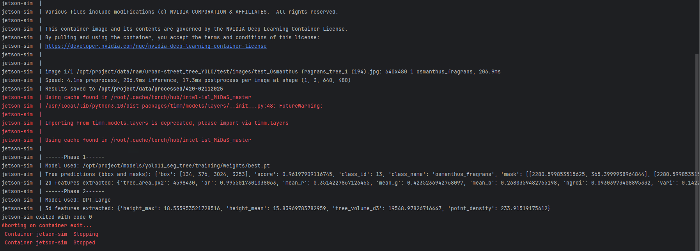
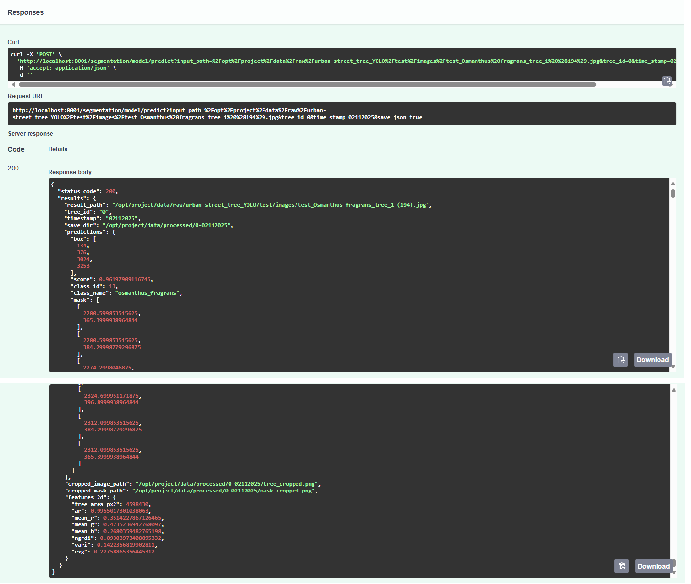
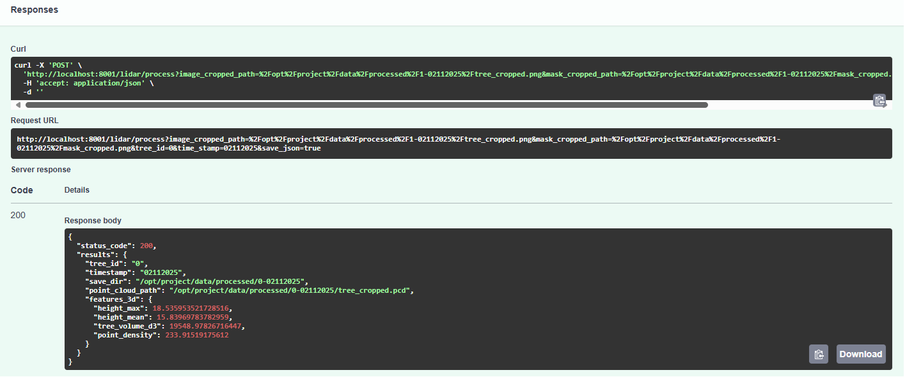

Hi, welcome to my project, this is my personal project called: Vegetation Health Monitor using some SoTA techniques and frameworks in AI, that is made to practice my skills in those fields.

For initial setup, please look at [README_SETUP](./README_SETUP.md)

I sketched this project into 4 phases, which might be changed constantly alongside the implementation, personally I don't even know if any phase of this project is doable for me, but I will learn of course and try to keep this file up to date. Because of that reason, this file will be finished last so the tone, content are not finalized like in README_SETUP :) Please understand

Also, I would be more than grateful and open to receive all comments, feedbacks or contributions!! 🙏 

# Idea: 
Create an end-to-end, deployable system that automatically detects urban trees in RGB imagery, fuses per-tree LiDAR structure across time, and outputs a calibrated health score + uncertainty and actionable recommendations via a small LLM agent, while demonstrating real-time, edge-capable inference (ONNX / TensorRT) on a Jetson-sim environment.

Sounds ambitious huh, I know... I will try my best.

**CURRENT UPDATE:** I've done Phase 1 and 2 🥳 - Also created a quick test without setting up the FastAPI endpoinds (in [single_image_to_pointcloud.py](../services/single_image_to_pointcloud.py))
- Simply input the img path (or use the example [test_img](../data/test_Osmanthus%20fragrans_tree_1%20(194).jpg) ) to `_input_path `, your saving directory (`_save_dir`) and you are GUCCI~
    
    

## Phase 1: Image detector for tree + tracking
- [x] Literature review and paper/project researches for inferences
  - **Big thanks** to these papers for guiding me into this field 🙏. I'll definitely add all the references properly later (finger crossed 🤞). Please forgive the slight delay, for now I'm deep in implementation land. 
  -  [Urban street tree dataset for image classification and instance segmentation](https://www.sciencedirect.com/science/article/abs/pii/S0168169923002405) 
      -  Large-scale dataset used in this project, with accurate instance masks.
  - [Mastering Vegetation Indices: NDVI, NVI, and VARI](https://farmonaut.com/remote-sensing/top-3-vegetation-indices-for-precision-agriculture)
    - Super comprehensive blog explaining the formulas, pros, and cons of common vegetation indices (NDVI, NVI, VARI). Perfect for newbies like me to brush up quickly without losing my mind 😎.
  - [Monitoring Autumn Phenology in Understory Plants with a Fine-Resolution Camera](https://www.mdpi.com/2072-4292/17/6/1025)
    - I found this paper accidentally while scrolling "Tree monitoring" images… and wow, interesting stuff!
    - This paper used the excess green index (ExG) that I also adopted, they also used green–red difference index (GRVI)- which is overkill for this project in my opinion, it pronounces in red leaves like Autumn Phenology and could be a part of monitoring, but I am aiming for the generic system ...
    - They normalized colors with R/G/B chromatic coordinates (R/G/BCC), I replaced these with mean_R/G/B for simplicity. Might revisit these as well if I have time 😄.
  - [Unveiling the Depths: A Comprehensive Comparison of Monocular Depth Models and LiDAR-Camera 3D Perception](https://www.research-archive.org/index.php/rars/preprint/download/2821/3951/3529)
    - I was stuck on converting 2D RGB images into 3D (because I don't have LiDAR + camera fusion), this paper was literally my life-saver ✨📚.
    - It shows a comparative analysis: LiDAR / LiDAR+camera vs Monocular Depth Estimation (MDE) from a single RGB camera (they used MiDAS and DPT and voilà!!).
      - Thanks to this, I applied MiDAS for depth estimation here, approximating z-values without true metric 3D coordinates. They claimed this way is not perfect (LiDAR is far more reliable) but a solid alternative to NVI as far as I know. 
  - [MiDAS tutorial](https://pytorch.org/hub/intelisl_midas_v2/)
    - Tutorial that I followed to implement MiDAS.
    
- [x] Exploring SoTA tree/tree health datasets
  - Mentioned above ([Urban street tree dataset for image classification and instance segmentation](https://www.sciencedirect.com/science/article/abs/pii/S0168169923002405)).
  - Download links:
    - [In original format (VOC2012)](https://www.kaggle.com/datasets/erickendric/tree-dataset-of-urban-street-segmentation-tree)
    - [In Supervisedly format (Used in this project)](https://datasetninja.com/urban-street-tree)
    - Conversion to YOLO is available at [supervisely_to_YOLO.ipynb](../notebooks/supervisely_to_YOLO.ipynb), no worries I got you 😉.
- [x] Training a segmenter on the Urban Street Tree dataset
  - Model used: `yolov11-seg` (get the trained model here: [best.pt](../models/yolo11_seg_tree/training/weights/best.pt))
  - Config used: see `models parameters` in [.env](../.env)
- [x] Using Ultralytics tracking with BYTETrack over a video or ordered frame folder to get persistent IDs per tree.
  - This step needs a fixed camera view over time (which I don't have tho), so I assume this BYTETrack tracking correctly assigns consistent tree IDs and timestamps across frames.
  - So it will create a folder with format `{tree_id}-{timestamp}`.
- [x] Crop ROI image, mask and extract 2d features
  - You may ask why both image and mask (or just me ask lol)? The answer is below (the 2 GIFs) but I'm not satisfied, will try a way to improve this.
  - Extracted 2D features:
  
  
**Expected Outcome:** per‑frame masks, per‑tree track IDs, cropped img/mask and 2D features over timestamps as below.

  

    
    
<em>predicted img</em>

  

  

    
    
<em>img cropped</em>

  

    

        
        
<em>masked cropped</em>

    

## Phase 2: Dept estimation for 3D conversion (LiDAR alternative)
- [x] Implement MiDAS for relative depth estimation on RBG
  - Model used: `DPT Large`
  - If you ran the script, either `single_image_to_pointcloud.py` or API `POST /lidar/model/load`, it takes 1-2mins to download and load the model for the first time (it's not a bug just be patient a bit 😉)
- [x] Input the 2 cropped image, cropped mask above to the model to estimate relative depth, then use it as the z-axe to construct point cloud file.
  - The file is saved as `.pcd` (see example [tree_cropped.pcd](../data/processed/420-02112025/tree_cropped.pcd))
- [x] Use point clouds individual trees and extract unique characteristics like DBH, height, canopy volume/density, shape, ...; store them accordingly with timestamps and geo keys to manage growth trends.
  - Same as 2D features above, I extracted some meaningful 3D features
  
  

- [x] Visualize the tree in point cloud
  - To visualize it, you will need CloudCompare, it should be as below:
  - Welp... you can see that the construction is far from reality 😅, which is expected, also why I decided not to use this estimated `z` values to construct NVI or NRI metrics and instead only extract generic features.

  

    
    
<em>tree in point cloud with suppressed background (using mask cropped above)</em>

  

    

        
        
<em>tree in point cloud with background (using only cropped image)</em>

    

**Expected Outcome:** Tree visualization and 3D metrics.

## Phase 3: Health estimation
- [ ] (**ON GOING**) Build a synthetic dataset per tree (I will get the tree → stretch to make it taller/shorter to mimic growth, change color a bit to mimic health condition)
  - Will be much much much appreciated if anyone suggests/helps me with this lol.
- [ ] Train a temporal aggregator (**Update**: I decided to go for LSTM) to track changes over time per tree, as the result estimate confidence or uncertainty
- [ ] Train small regressor/classifier on fused features to predict health score 

**Expected Outcome:** a per‑tree health score per timestamp, enabling flags like stable/improving/declining.

## Phase 4:  LangChain/LangGraph multi‑agent on the edge (IDK which will I use yet)
- [ ] Add a small agent service that take all above inputs (vision API, LiDAR, ...) to provide reasoning and return  decisions like "urgent prune," "enlarge pit 30 cm," or "plant drought‑tolerant species," ...

## Tech Summary:

To sum up, the project might involve:

Tree Image/Frame → Segmenter (YOLOv11) → LiDAR/Point cloud → Temporal (RNN / GRU / LSTM / Transformer / ViT-based) → Fusion + Health Prediction (MLP, small CNN) → Reasoning and Decision-Making (text, LLM)

