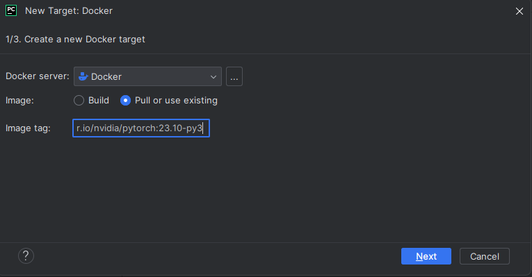

# Simulate NVIDIA Jetson
Since I don’t have the official Jetson hardware (cost around 150-500 for the nano version), I mimic the Jetson software environment (CUDA, cuDNN, PyTorch versions, etc.) with `x86` version image available inside my local, while
in original NVIDIA Jetson devices, they are `ARM64`-based platforms. It may not fully utilize GPU acceleration unless specific configurations are made, but it matches the same JetPack libraries that Jetson uses and make sure your code and dependencies will work the same when deployed to Jetson.

## Get and Pull Image
The Docker image: `nvcr.io/nvidia/pytorch:23.10-py3` 

Images can be found here based on the version you desire: [NVIDIA Pytorch Images](https://docs.nvidia.com/deeplearning/frameworks/pytorch-release-notes/rel-23-10.html)

To pull, in your WSL, run:

`docker pull nvcr.io/nvidia/pytorch:23.10-py3`

More information about the setup can be found here: [Install TensorFlow for Jetson](https://docs.nvidia.com/deeplearning/frameworks/install-tf-jetson-platform/index.html)


(Optional) After pulling, run this to check compatibility:

`docker run --rm --entrypoint uname nvcr.io/nvidia/pytorch:23.10-py3 -m`

If it prints `x86_64` → we are good. In real Jetson environment should be `aarch64` instead.

## Run Image
After pulling image to your local, run it for the first time:

`docker run -it --gpus all -v $PWD:/workspace --name jetson-sim nvcr.io/nvidia/pytorch:23.10-py3`

with  `jetson-sim` after `--name` is your custom name, otherwise Docker will name it with something random, but it's best practice to name and control it yourself.

Everytime you need to run again, run:

`docker start -ai jetson-sim`

If your terminal shows as below, you are good to go!


## Install packages and link to IDE

To install necessary packages (most of them are already combined in the image but just in case), run:

```
pip install --upgrade pip
pip install torch torchvision onnx onnxruntime tensorrt fastapi uvicorn numpy
```

### Pycharm
To link the created image to Pycharm, go to:

`settings -> project -> Python Interpreter -> Add Interpreter -> On Docker`


Step 1:

Hit: `Pull or use existing` since we already pulled the image above

Image tag: `nvcr.io/nvidia/pytorch:23.10-py3` 


Step 2:

If you did everything correctly, it should try to use the image you already pulled. Hence, this step only reads the cached image and should not take much time:


Step 3:

Choose: `System Interpreter`

Click `Create`


That's it! It should work like a charm!!!

## Git LFS (Optional)
If you want to manage large files like `.pt`, `.onnx`, or big datasets, then you might need these to avoid bloating your repo.
Otherwise, simply add those to `.gitignore` and keep them in local.


Run:
```
git lfs install
git lfs track "*.pt"
git add .gitattributes
```

If above didn't work, meanwhile `lfs` is not yet installed, instead run below first:
```
# Install dependencies
apt-get update
apt-get install -y curl software-properties-common

# Add Git LFS repo
curl -s https://packagecloud.io/install/repositories/github/git-lfs/script.deb.sh | bash

# Install it
apt-get install -y git-lfs

# Initialize
git lfs install
```
Verify if it works: `git lfs version`
The process should be as below:


