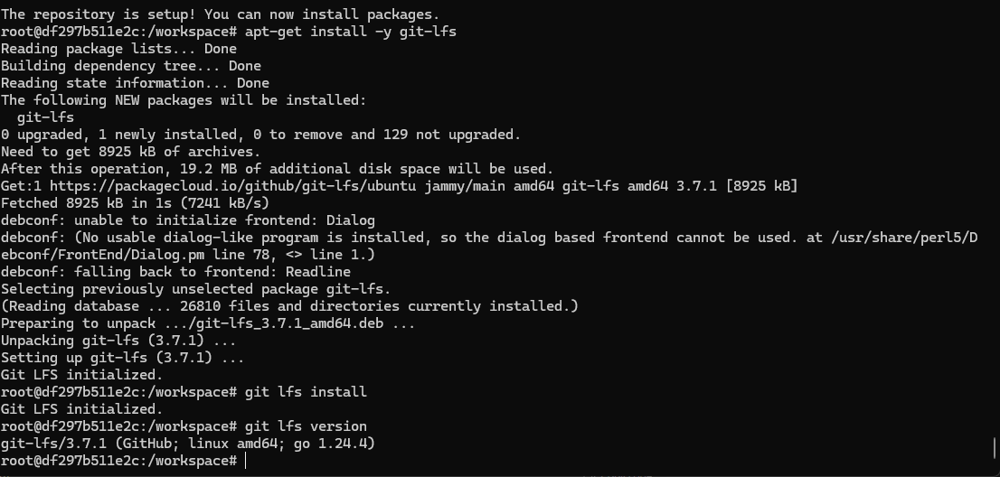

# 🧠 Simulate an NVIDIA Jetson (Without Actually Owning One)
So... you don't have a Jetson board lying around (same here — the Nano alone costs like €200–€500 😭). No worries! We can simulate the Jetson software environment — meaning same CUDA, cuDNN, and PyTorch versions — using the x86 version of NVIDIA's official PyTorch Docker image.

Jetsons are based on `ARM64`, while your regular laptop/PC (also mine of course) is `x86_64` — so you won't get full GPU acceleration exactly like the Jetson, but it matches the same JetPack libraries that Jetson uses and make sure your code and dependencies will work the same when deployed to Jetson.

## 🧩 Get and Pull the Image
We'll use this image: 

```
nvcr.io/nvidia/pytorch:23.10-py3
``` 

You can find other desired versions here: [NVIDIA Pytorch Images](https://docs.nvidia.com/deeplearning/frameworks/pytorch-release-notes/rel-23-10.html)

To pull it in WSL (or any familiar Linux terminal):

```
docker pull nvcr.io/nvidia/pytorch:23.10-py3
```

More information about the setup can be found here: [Install TensorFlow for Jetson](https://docs.nvidia.com/deeplearning/frameworks/install-tf-jetson-platform/index.html)


(Optional) If you want to double-check architecture compatibility:

```
docker run --rm --entrypoint uname nvcr.io/nvidia/pytorch:23.10-py3 -m
```

If it prints `x86_64` → perfect ✅. On a real Jetson environment should be `aarch64` instead.

## 🚀 Run the Image
Once it's pulled, spin it up like this for the first time:

```
docker run -it --gpus all -v $PWD:/workspace --name jetson-sim nvcr.io/nvidia/pytorch:23.10-py3
```

with  `jetson-sim` after `--name` is your container's nickname (you can name it whatever you like — otherwise Docker will call it something random like “gallant_narwhal”, and we don't want that so control it yourself 😉).


Note: Make sure `$PWD` is your current working directory, If you're not sure, replace it manually with your path `$PWD` → `your/actual/path`


If your terminal shows something like this, LET'S GO you are inside `jetson-sim`!!


## ⚙️ Install Packages & Save the Image

The image already comes with most ML packages, but just in case, run:

```
pip install --upgrade pip
pip install torch torchvision onnx onnxruntime tensorrt fastapi uvicorn numpy
```

Then, once you've got your setup perfect, don't forget save your current state as a new image:

```
docker commit jetson-sim develop-jetson-sim-image
```

with `jetson-sim` → your running container, `develop-jetson-sim-image` → new image name you're creating (I'm lazy repeating this, so I will just use my names `jetson-sim` and `develop-jetson-sim-image` directly, you know what they are)


Now you can relaunch it:

```
docker run -it --gpus all -v your/actual/path:/workspace --name jetson-sim develop-jetson-sim-image
```

Don't forget `--gpu-all` to let docker access to your local GPU. Otherwise, Docker will fall back to CPU — and you'll regret it when your training takes 12 hours instead of 12 minutes 😬 (believe me I suffered ...).

###  Setting Up in PyCharm
There are two ways to link Docker to PyCharm (as far as I know)— choose your fighter:

#### Link by Image

- **Pros**: Simple and the interpreter persists through runs.
- **Cons**: Doesn't auto-update when you re-commit a new image — you'll need to re-add the interpreter.

**1.** Go to
`settings -> project -> Python Interpreter -> Add Interpreter -> On Docker`


**2.** Select `Pull or use existing` since we already pulled the image above

Choose your image tag: 
- ```develop-jetson-sim-image:latest``` if you committed earlier
- ```nvcr.io/nvidia/pytorch:23.10-py3``` otherwise.

*Tips: Try to choose from the dropdown instead of typing manually as shown below, if you did correctly your image should be visible to Pycharm.


**3.** It should try to use the image you already pulled. Hence, this step only reads the cached image and should not take much time:


Choose `System Interpreter` and click `Create`


That's it! You're connected 🎉🎉🎉!

If PyCharm acts up (red underlines, missing packages which I suffered), just invalidate caches:

`File → Invalidate cache → Invalidate and Restart`

If yours shows something like this with all packages shown, again you're connected 🎉🎉🎉🎉🎉:


To verify GPU access, run:
`nvidia-smi`

in both IDE and terminal, if you see your GPU, yayyy!!!

#### Link by Docker Compose
- **Pros:** Changes apply automatically (since it's tied to a running **Container**, not Image)
- **Cons:** Requires an additional `docker-compose.yml` file and isn't persistent between runs

**1.** Create `docker-compose.yml`, (example mine here [docker-compose.yml](../dockerfiles/docker-compose.yml)).

**2.** In WSL, navigate to the directory having created `docker-compose.yml` run:

```
docker compose down
docker compose up -d
```

where `down` removes the old container completely if any, `up -d` recreates it with the new settings in background mode.

If you already have a container named `jetson-sim`, remove it first: 

```
docker rm -f jetson-sim
```

Verify if it's using your new settings:

```
docker inspect jetson-sim | grep IpcMode
```

Should show `"IpcMode": "host",` as picture below ✅.


**3.** Go to:
`settings -> project -> Python Interpreter -> Add Interpreter -> On Docker Compose`


**4.** In `Configuration files`, browse and select `docker-compose.yaml`.

The `Service` should automatically show your container (e.g `jetson-sim`).


**5.** Simply hit `Next` when done and choose `System Interpreter`.


**6.** Hit `Run`  to verify the work, if everything's good, you'll see something like: 

`jetson-sim | ...running your code...` 


That it! Woohoo!! 🎉🎉🎉🎉🎉

# 📦 Git LFS (Optional but Cool)
If you're pushing big files like `.pt`, `.onnx`, or dataset files, use [Git LFS](https://git-lfs.com/) to keep your repo clean and light.
If you deny this cool stuff, simply add those to `.gitignore` and keep them in local.


Run:
```
git lfs install
git lfs track "*.pt"
git add .gitattributes
```

If it says `command not found`, install it manually:
```
# Install dependencies
apt-get update
apt-get install -y curl software-properties-common

# Add Git LFS repo
curl -s https://packagecloud.io/install/repositories/github/git-lfs/script.deb.sh | bash

# Install it
apt-get install -y git-lfs

# Initialize
git lfs install
```
Verify if it works: 

```
git lfs version
```

You'll see something like 👇:




# 📓 Jupyter Integration (Optional but Kinda Cool)
If you want to run `.ipynb` notebooks inside Docker, here's the move. If you decided to use an available kernel outside, skip this :)

Inside the container:

```
# This should be already installed but just in case
pip install jupyter

# Install kernel package
pip install notebook ipykernel

# Create new kernel
/workspace/notebooks# python -m ipykernel install --user --name=jetson-sim --display-name "Python (Jetson Sim)"
```

A kernel named `Python (Jetson Sim)` is created, you can use it to run cells.

Then exit and restart Docker with a port exposed:

`exit`

to get back to WSL, then:

```
docker stop jetson-sim

docker rm jetson-sim
```

Run image again, add `-p` to specify port you want to mount:

```
docker run -it --gpus all -v /mnt/d/Projects/VegetationHealthMonitor:/workspace -p 8888:8888 --name jetson-sim develop-jetson-sim-image
```

Then simply start Jupyter, there are 2 ways to do it, direct run or via config:

**Direct Run🏃‍♂️‍➡️:**
```
jupyter notebook \
    --ip=0.0.0.0 \
    --port=8888 \
    --allow-root \
    --NotebookApp.token='<your-fixed-token>'
```

Input your `<your-fixed-token>` so the server doesn't generate random one.


**Via Config 🔧:**

Generate config file:

```
jupyter notebook --generate-config
```

You can use nano or vi (or whatever editor works inside the container):

```
nano ~/.jupyter/jupyter_notebook_config.py
```

Press `Ctrl + W` to find, navigate and set the following:

```
c.NotebookApp.token = '<your-fixed-token>'
c.NotebookApp.allow_root = True
c.NotebookApp.ip = '0.0.0.0'
c.NotebookApp.open_browser = False
```

*Note: In the default config file, most lines are commented out with #. You need to uncomment the line and set it.

Save (`Ctrl + O`), it will ask for File Name to Write (should show the current filename) → press Enter to confirm.

Exit (`Ctrl + X`).

When you want to start Jupyter:

```
jupyter notebook --config=~/.jupyter/jupyter_notebook_config.py
```

Boom 💥 Your `Python (Jetson Sim)` notebook kernel is ready to roll.


# 🧩 Ending
Hopefully now you have a Jetson lookalike setup running locally — same libraries, same vibe, none of the `ARM` headaches (or the price tag 💸).
Deploying to real hardware later? Easy. It'll just work 🤞.


